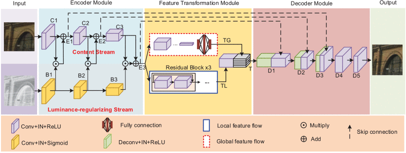
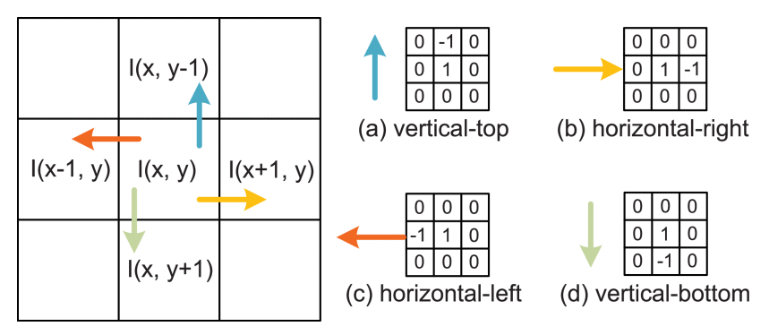
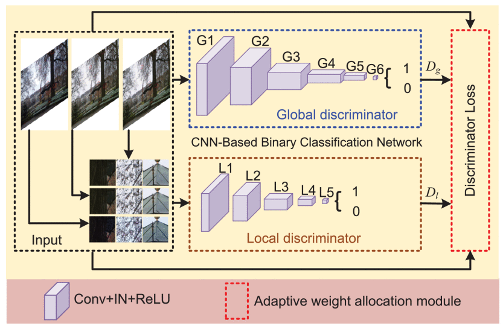
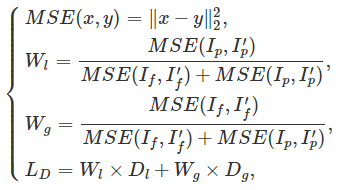

## MIEGAN: Mobile Image Enhancement via a Multi-Module Cascade Neural Network

#### 1. Overview

The code of MIEGAN is implemented based on the "[DSLR-Quality Photos on Mobile Devices with Deep Convolutional Networks](https://github.com/aiff22/DPED#dslr-quality-photos-on-mobile-devices-with-deep-convolutional-networks)". Therefore, you  need to download its code and then replace the network of MIEGAN.

#### 2. The contributions of MIEGAN are：

- **The Multi-Module Cascade Generative Network**

  

- **The contrast loss and mixed loss function for generator**

  

- **Adaptive Multi-Scale Discriminative Network**

  

- **The adaptive weight allocation scheme for discriminator**

  

And their corresponding implements can be found in `network.py` and `utils.py`

## Citation

If you find our paper or code useful for your research, please cite:

```bib
@ARTICLE{9339887,
  author={Pan, Zhaoqing and Yuan, Feng and Lei, Jianjun and Li, Wanqing and Ling, Nam and Kwong, Sam},
  journal={IEEE Transactions on Multimedia}, 
  title={MIEGAN: Mobile Image Enhancement via a Multi-Module Cascade Neural Network}, 
  year={2022},
  volume={24},
  number={},
  pages={519-533},
  doi={10.1109/TMM.2021.3054509}}
```

